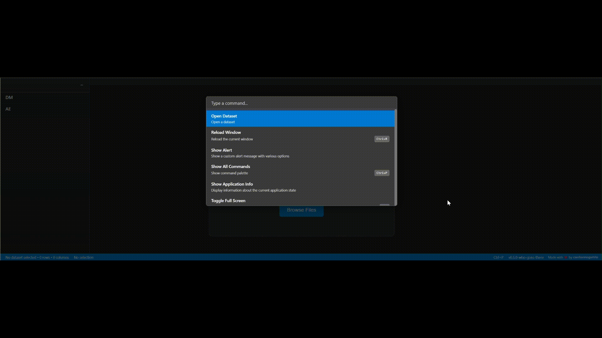
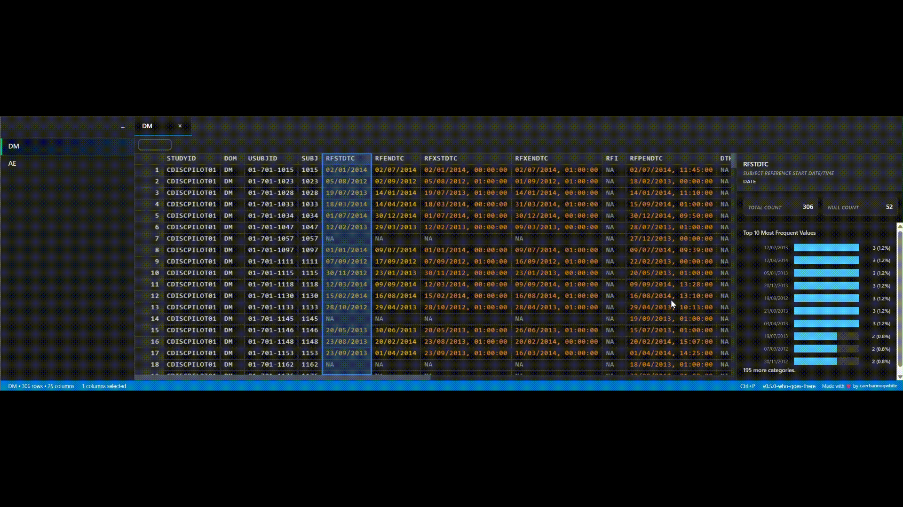
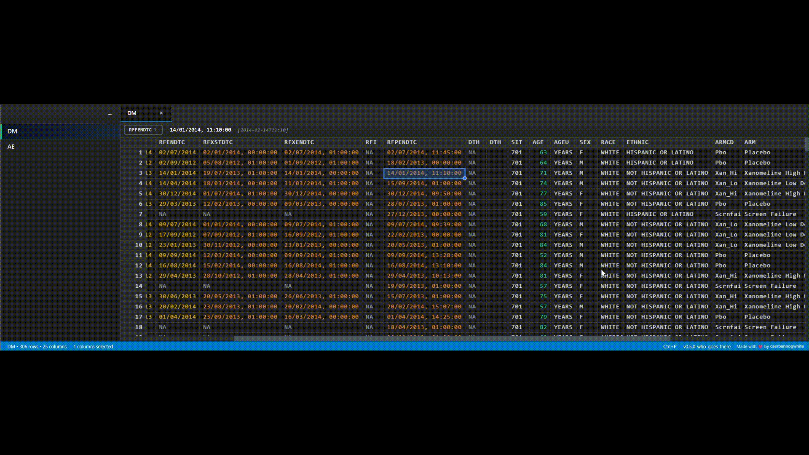
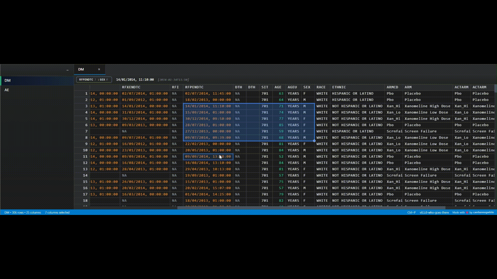
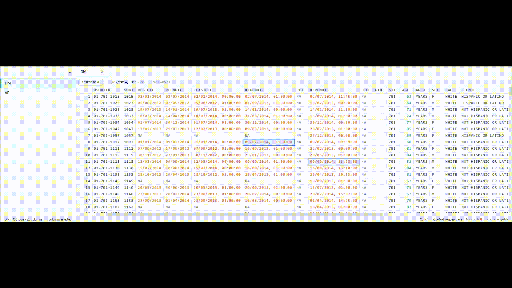

# Brian

A simple, local-first spreadsheet data viewer.

[Live Demo](https://caerbannogwhite.github.io/brian/)

## Features

- 📈 **Column statistics** and data analysis
- 🎨 **Responsive design** that works on all screen sizes
- ⚡ **High performance** with virtual scrolling

### Open Dataset

### Columns Statistics

### Export Selection

### Toggle Theme

### Toggle Panel

## License

This project is licensed under the MIT License - see the LICENSE file for details.

## Changelog

See [CHANGELOG](CHANGELOG) for version history and updates.
